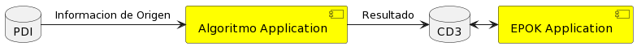
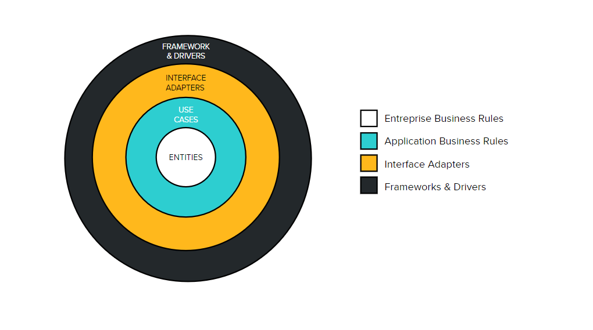
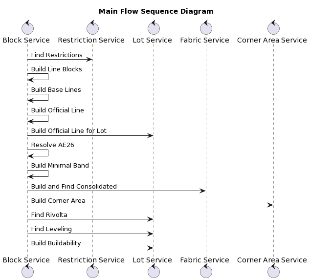

# Descripción General de la aplicación

La aplicación está concebida para dar solución a un proceso de cálculo de edificabilidad máxima para todas las parcelas de la Ciudad, en base a un algoritmo que está determinado y restringido por un Código Urbano. A través de la provisión de diversas APIs, busca generar un proceso de cálculo que recupera información de un sistema origen, realiza el cálculo y lo exporta para que otro sistema publique esa información en un portal (Ciudad 3D) donde acceden los ciudadanos para conocer la edificabilidad de las parcelas.
La aplicación en el marco del proyecto Ciudad 3D se desarrolló con base en los siguientes objetivos:

*	Generar algoritmos para desarrollar geometrías como insumo para el cálculo de volumetrías necesarias para la visualización de las reglas del Código Urbanístico de CABA en Ciudad 3D. y para alcanzar la edificabilidad máxima.
*	Diseñar una solución que permita incorporar o modificar nuevas reglas según las actualizaciones periódicas que presenta el código urbanístico.
*	Construir una solución de manera de automatizar el proceso de cálculo de volumetrías de edificabilidad y hacerlo escalable en función a la actualización de datos.
*	Optimizar los tiempos de ejecución del cálculo de volumetrías, de manera que la aplicación pueda dar respuesta dentro de un tiempo de procesamiento mínimo, con una frecuencia a demanda.

# Componentes de la solucion. Landscape

La aplicacion esta compuesta por un application server que se conecta a dos diferentes Base de datos.
Para su funcionamiento se proveen APIs que permiten la ejecucion de los algoritmos con diferentes salidas
Se detalla un diagrama con el landscape de componentes



# Lenguaje y Arquitectura del proyecto

Se ha utilizado el lenguaje python como lenguaje de desarrollo. Este lenguaje cuenta con librerias de codigo abierto que manipulan geometrias.
Los principales paquetes que se utilizan son:
- Django (Application Server)
- Geopandas (Manipulacion de Geometrias)
- Shapely (Manipulacion de Geometrias)
- Ezdxf (Manipulacion de archivos dxf autocad)
- APScheduler (Planificador de jobs)
  
La aplicación-solución se desarrolla en base a una arquitectura limpia (clean architecture) que permite que el código sea mantenible y testeable. La estructura de esta arquitectura está compuesta por diferentes capas:



**ENTIDADES (entity)**
Las entidades incluyen las reglas de negocio críticas para el sistema. Estas entidades pueden ser utilizadas por distintos componentes de la arquitectura, por lo que son independientes y no deben cambiar a consecuencia de otros elementos externos.

Una entidad engloba un concepto crítico para el negocio y se separa lo máximo posible del resto de conceptos. La entidad recibe los datos necesarios y realiza operaciones sobre ellos para conseguir el objetivo deseado.

**CASOS DE USO (service)**
Los casos de uso representan las reglas de negocio aplicables a una aplicación concreta. Estos casos de uso siguen un flujo para conseguir que las reglas definidas por las entidades se cumplan. Los casos de uso solo definen cómo se comporta el sistema, definiendo los datos de entrada necesarios y cuál será su salida. Los cambios en esta capa no deberían afectar a las entidades, al igual que los cambios en otras capas externas no deberían afectar a los casos de uso.
Es importante resaltar que en este punto no se trabaja sobre la presentación al usuario sino que un caso de uso recibe datos estructurados y devuelve más datos estructurados.

**ADAPTADORES DE INTERFAZ (adapter)**
Los datos generados por los casos de uso y las entidades tienen que transformarse en algo entendible por la siguiente capa que los va a utilizar y de eso se encarga esta capa. Los adaptadores de interfaz convierten la interfaz de un objeto, de forma que otro objeto pueda comprenderla.
Lo mismo aplica para presentar información a un servicio externo, ya que en esta capa se define la manera en la que los datos de las capas internas se presentan al exterior.

**FRAMEWORKS Y DRIVERS (app)**
En esta capa es donde van todos los componentes de Entrada y Salida: la interfaz de usuario, la base de datos, los marcos y los dispositivos. Es la capa más volátil porque los elementos contenidos aquí tienen más probabilidades de cambiar.

**SCRIPTS**
Por otro lado, existe la carpeta de scripts, que contiene bash de instalación y operación de la aplicación.

# Documentacion API publicada

## End-point: launch
### Method: POST
>```
>https://motor-reglas-ciudad3d-qa.gcba.gob.ar/api/launch/
>```
### Headers

|Content-Type|Value|
|---|---|
|Content-Type|application/json|


### Headers

|Content-Type|Value|
|---|---|
|Accept|application/json|


### Headers

|Content-Type|Value|
|---|---|
|apikey|88d346b3-00ed-4793-8bb2-179e4ff96b81|


### Body (**raw**)

```json
{
  "blocks":["042-067"]
}
```

### Response: 200
```json
[
    {
        "folder": "media/tmp",
        "simple_name": "",
        "root_name": "d29997ff-3fbd-400d-80c1-efa5db769795",
        "path": "./media/tmp/d29997ff-3fbd-400d-80c1-efa5db769795.gpkg",
        "url": "/download/d29997ff-3fbd-400d-80c1-efa5db769795.gpkg"
    }
]
```


⁃ ⁃ ⁃ ⁃ ⁃ ⁃ ⁃ ⁃ ⁃ ⁃ ⁃ ⁃ ⁃ ⁃ ⁃ ⁃ ⁃ ⁃ ⁃ ⁃ ⁃ ⁃ ⁃ ⁃ ⁃ ⁃ ⁃ ⁃ ⁃ ⁃ ⁃ ⁃ ⁃ ⁃ ⁃ ⁃ ⁃ ⁃ ⁃ ⁃ ⁃ ⁃ ⁃ ⁃ ⁃ ⁃ ⁃

## End-point: download
### Method: POST
>```
>http://localhost:8000/api/download/
>```
### Headers

|Content-Type|Value|
|---|---|
|Content-Type|application/json|


### Headers

|Content-Type|Value|
|---|---|
|Accept|application/json|


### Headers

|Content-Type|Value|
|---|---|
|apikey|******************************************|


### Body (**raw**)

```json
{
  "block":"042-067"
}
```

### Response: 200
```json
[
    {
        "folder": "media/tmp",
        "simple_name": "",
        "root_name": "d29997ff-3fbd-400d-80c1-efa5db769795",
        "path": "./media/tmp/d29997ff-3fbd-400d-80c1-efa5db769795.gpkg",
        "url": "/download/d29997ff-3fbd-400d-80c1-efa5db769795.gpkg"
    }
]
```

⁃ ⁃ ⁃ ⁃ ⁃ ⁃ ⁃ ⁃ ⁃ ⁃ ⁃ ⁃ ⁃ ⁃ ⁃ ⁃ ⁃ ⁃ ⁃ ⁃ ⁃ ⁃ ⁃ ⁃ ⁃ ⁃ ⁃ ⁃ ⁃ ⁃ ⁃ ⁃ ⁃ ⁃ ⁃ ⁃ ⁃ ⁃ ⁃ ⁃ ⁃ ⁃ ⁃ ⁃ ⁃ ⁃ ⁃

## End-point: health
### Method: GET
>```
>http://localhost:8000/health
>```
### Headers

|Content-Type|Value|
|---|---|
|Content-Type|application/json|


### Headers

|Content-Type|Value|
|---|---|
|Accept|application/json|


### Body (**raw**)

```json
{
  "block":"042-067"
}
```

### Response: 200
```json
[
    {
        "folder": "media/tmp",
        "simple_name": "",
        "root_name": "d29997ff-3fbd-400d-80c1-efa5db769795",
        "path": "./media/tmp/d29997ff-3fbd-400d-80c1-efa5db769795.gpkg",
        "url": "/download/d29997ff-3fbd-400d-80c1-efa5db769795.gpkg"
    }
]
```

# Descripcion de la capa de servicios dentro del proyecto

*ArchaeologicalRiskService*
- find_all
Este servicio provee los métodos de recuperación de los objetos dentro del repositorio de PDI con características de riesgo arqueológico.

*BlockService*
- run_algorythms
Servicio para la ejecución de los algoritmos de la solución. Por cada manzana ejecuta una serie de pasos para la generación de volumetrías.
- export_cad
Método que provee la exportación a archivo de formato DXF (CAD), necesario para que el usuario disponga de los objetos resultantes del procesamiento de algoritmos.
- export
Servicio con la función de exportar datos en formato mbtile, consumidos por el front-end de Ciudad 3D.
- export_data
Exportación de la información para la plataforma Ciudad 3D.
- find_all
Recupera del repositorio todas las manzanas.
- find_by_blocks_sections
Recupera del repositorio todas las manzanas por identificación de la manzana o identificación de la sección.
- find_restrictions
Servicio para la identificación de objetos con restricciones.
- find_front_lot
Identificación de objetos (parcelas) sobre el frente opuesto perpendicularmente. Este servicio se utiliza en la recuperación de insumos para la aplicación de la regla de Áreas de Arquitectura Especial tipo 26, áreas que por el carácter histórico-cultural, tradicional o ambiental que ya poseen, son objeto de un ordenamiento especial mediante normas particularizadas con el fin de preservar dicho carácter.

*BuildTypeService*
- find_by_build_info
Recupera el tipo de edificabilidad por la información proveniente de PDI, entendiendo por unidad de edificabilidad las diferentes clasificaciones de las alturas y condiciones de conformidad al Título 6 del Código Urbanístico.
- find_by_code
Recupera el tipo de edificabilidad por el código correspondiente.

*CornerAreaService*
- build
Método de construcción del área de esquina. Se entiende como tal a aquella conformada a partir de la extensión del Espacio Libre de la Manzana de tipo regular, en el caso de parcelas que disten menos de la distancia determinada por la prolongación virtual de las Líneas de Frente Interno concurrentes más nueve metros (9m), hasta una distancia máxima de treinta y cuatro metros (34m) de las prolongaciones de las Líneas Oficiales concurrentes.

*CustomBuildabilityService*
- find_by_block
Recupera desde PDI la información por manzana necesaria para el cálculo de edificabilidad customizada.

*CustomLineService*
- find_by_block
Recupera a nivel de manzana desde PDI la información necesaria para el cálculo de líneas customizadas, como ser Líneas Internas de Basamento o Líneas de Frente Interno.

*CustomLotLineService*
- find_by_block
Recupera a nivel de líneas de parcela desde PDI la información necesaria para el cálculo de líneas customizadas, como ser Líneas Internas de Basamento o Líneas de Frente Interno.

*FabricService*
- find_by_block
Recupera tejidos a nivel de manzana.

- build_consolidated
Construye el tipo de consolidación, entendiendo edificios consolidados aquellos cuya altura sea igual o mayor al setenta y cinco por ciento (75%) de la altura máxima establecida para su Unidad de Edificabilidad.

*HydricRiskService*
- find_all
Este servicio provee los métodos de recuperación de los objetos dentro del repositorio de PDI con características de riesgo hídrico.

*LotService*
- build_official_line
Construcción de la Línea Oficial, entendida como la línea que deslinda la parcela de la vía pública actual o la línea señalada por el Gobierno para la futura vía pública.
- find_by_blocks
Recupera parcelas en base a la identificación de la manzana.
- find_complete_by_block
Completa la información de la parcela en base a la manzana, de manera de componer las diferentes entidades que componen el objeto parcela.
- analize_heights
Recupera las alturas pertinentes al análisis para la construcción de volumetrías.
- require_corner_area
Valida si al Área de Esquina es requerida para la construcción de volumetrías.
- find_leveling
Construye los diferentes tipos de enrase en aquellos casos donde se permite el completamiento de tejido o edificabilidad cuando la altura de alguno de los edificios linderos supera la altura máxima de la parcela a edificar.
- find_rivolta
Búsqueda y recuperación de Rivolta para la manzana. Ésta es entendida como la forma en que debe darse la transición de altura en el encuentro de dos normativas de altura diferentes en la misma esquina de la manzana.
- build_buildability
Servicio principal que tiene como propósito la construcción de la edificabilidad de las N volumetrías para las parcelas.
- validate_buildability_block
Realiza la validación de la edificabilidad a nivel manzana.
- validate_buildability
Realiza la validación de la edificabilidad a nivel parcela.

*RestrictionService*
- find_all
Este servicio provee los métodos de recuperación de los objetos dentro del repositorio de PDI con características de restricciones.
- validate
Valida las restricciones por manzana, verificando que la restricción tenga impacto en la manzana correspondiente.
- build_with_restrictions
Construye las manzanas aplicando las restricciones.
- find_with_restrictions
Realiza la búsqueda y recuperación de las manzanas que poseen restricciones.

# Diagrama de secuencia del algoritmo  ejecutados por manzana



# Implementacion en el entorno de Desarrollo ASI (dev)

## Instalacion
    Para instalar se ejecutar el script ubicado dentro de la VM en 
    ~/app/bin/instalar.sh

## actualizacion de version

    Para actualizacion la version de la aplicacion, se debe ejecutar dentro le la VM
    ~/app/bin/update.sh

## ejecutar

    Para levantar el servicio, se debe ejecutar dentro le la VM
    ~/app/bin/run.sh

# Base de Datos

## Requerimientos

    Tanto la BBDD "PDI" como "epok" deben correr en un servidor Postgresql 13+ con el componente PostGIS 3.2.2 correctamente instalado. Este componente permite almacenar y manipular datos geográficos. Información para la instalación y configuración se puede encontrar en [PostGIS](https://postgis.net/install/).

## DataSet de pruebas

    Con el objeto de poder probar el funcionamiento del algoritmo, se anexa el un script de sql que crea las estructuras necesarias en las bases de datos y las rellena con un subconjunto de datos de PDI pertenecientes al barrio de Palermo.
